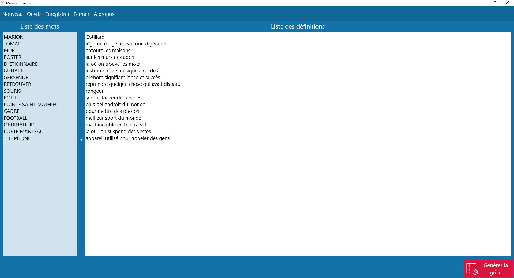
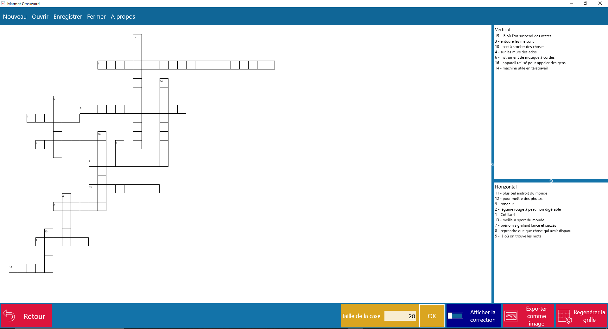

# Marmot Crossword

Marmot Crossword est un logiciel pour générer des mots croisés.

Pour cela, il faut tout d'abord entrer une liste de mots et de définitions, puis  cliquer sur générer la grille.

Ensuite, on arrive sur la grille générée. On peut:

- modifier la taille de la case
- agrandir l'espace pour les définitions
- afficher la correction
- régénérer la grille
- exporter comme image

Dans le menu, on peut sauvegarder notre grille pour la réouvrir plus tard. 

